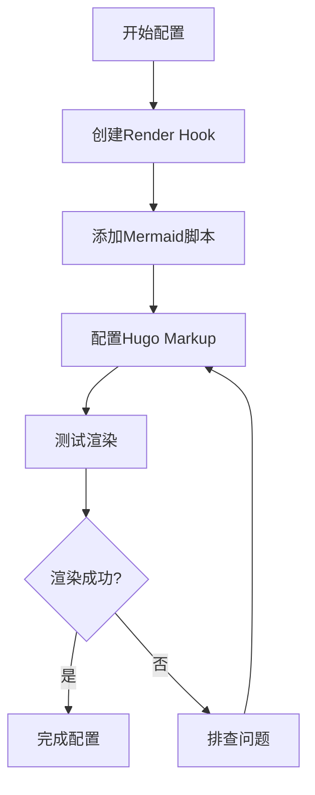
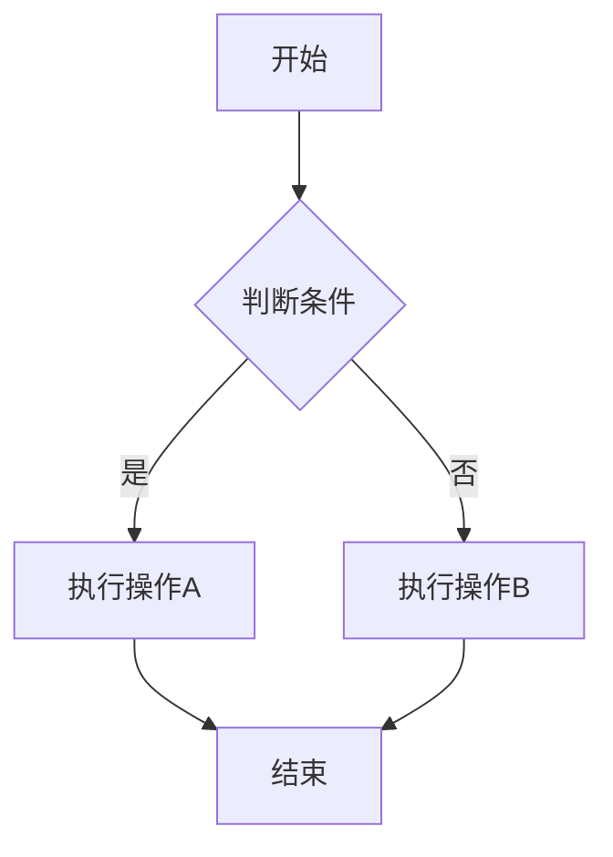
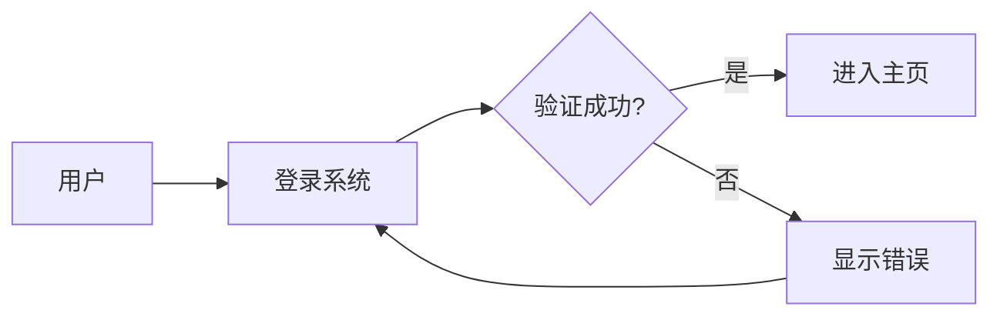
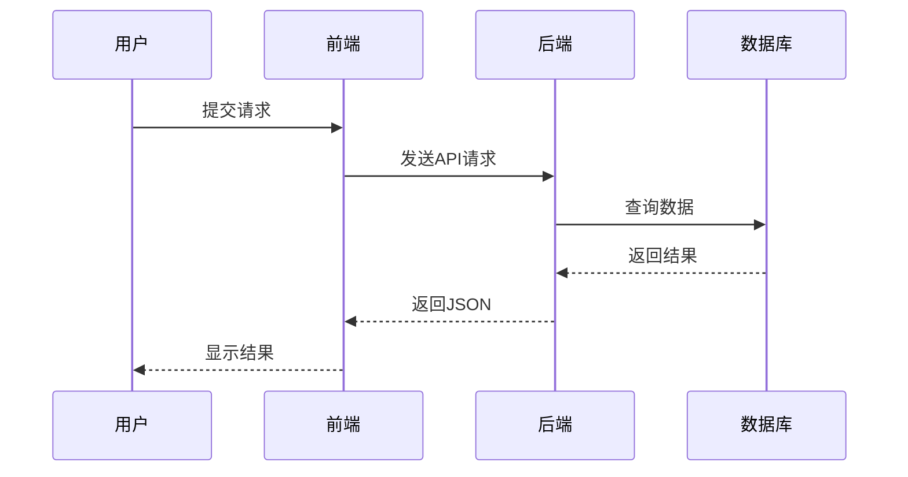
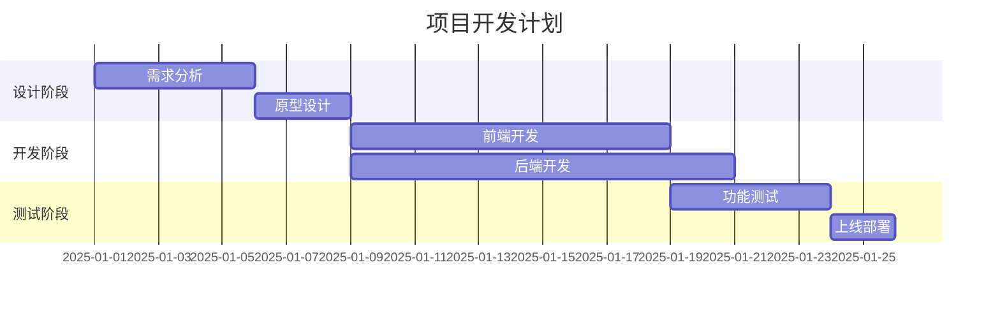

+++
date = '2025-01-27T10:00:00+08:00'
draft = false
title = '在Hugo中配置Mermaid图表支持'
+++

Mermaid是一个强大的图表和流程图生成工具，可以通过简单的文本语法创建各种图表。在Hugo博客中集成Mermaid支持，可以让你在Markdown文章中直接绘制流程图、时序图、甘特图等，极大提升技术文档的可读性和专业性。

## 为什么选择Mermaid？

- **纯文本语法**：使用Markdown类似的语法，无需图形界面工具
- **版本控制友好**：图表代码可以像代码一样进行版本管理
- **多种图表类型**：支持流程图、时序图、甘特图、类图、状态图等
- **自动渲染**：在浏览器中自动渲染为SVG矢量图

## 配置流程概览

在Hugo中配置Mermaid支持的整体流程如下：



## 详细配置步骤

### 1. 创建Mermaid Render Hook

Hugo使用Render Hook来自定义代码块的渲染方式。我们需要创建一个专门的hook来处理mermaid代码块。

在项目根目录下创建以下文件：

**文件路径**：`layouts/_default/_markup/render-codeblock-mermaid.html`

**文件内容**：

```html
<div class="mermaid">
{{- .Inner -}}
</div>
```

这个文件的作用是：当Hugo遇到 ` ```mermaid ` 代码块时，会将其转换为 `<div class="mermaid">` 元素，而不是普通的代码块。

### 2. 添加Mermaid JavaScript支持

接下来需要在页面中加载Mermaid的JavaScript库，并初始化渲染。

**文件路径**：`layouts/partials/extend_footer.html`

**文件内容**：

```html
{{- /* Footer custom content area start */ -}}
{{- /* 添加Mermaid支持 */ -}}
<script src="https://cdn.jsdelivr.net/npm/mermaid@10/dist/mermaid.min.js"></script>
<script>
  // 初始化mermaid并渲染页面中的所有mermaid图表
  mermaid.initialize({ 
    startOnLoad: true, 
    theme: 'default',
    securityLevel: 'loose'
  });
  // 确保所有mermaid元素都被渲染
  if (document.querySelectorAll('.mermaid').length > 0) {
    mermaid.run();
  }
</script>
{{- /* Footer custom content area end */ -}}
```

**说明**：
- 使用CDN加载Mermaid库（版本10）
- `startOnLoad: true` 表示页面加载时自动渲染
- `securityLevel: 'loose'` 允许更灵活的配置
- `mermaid.run()` 确保所有mermaid元素都被正确渲染

### 3. 配置Hugo Markup设置

在Hugo配置文件中启用必要的markup设置。

**文件路径**：`hugo.toml`（或`config.toml`）

在配置文件中添加以下内容：

```toml
# 启用Mermaid支持
[markup]
  [markup.highlight]
    # 代码高亮配置
    noClasses = false
  [markup.goldmark]
    [markup.goldmark.renderer]
      # 启用不安全的HTML渲染（mermaid需要）
      unsafe = true
```

**重要**：`unsafe = true` 是必需的，因为Mermaid需要渲染HTML内容。

### 4. 在文章中使用Mermaid

配置完成后，你就可以在Markdown文章中使用Mermaid语法了：

````markdown

````

渲染效果：


## Mermaid图表类型示例

### 流程图（Flowchart）



### 时序图（Sequence Diagram）



### 甘特图（Gantt Chart）



## 常见问题排查

### 问题1：图表不显示

**可能原因**：
- Mermaid脚本未正确加载
- Render Hook文件路径不正确
- 浏览器控制台有JavaScript错误

**解决方法**：
1. 检查浏览器控制台的错误信息
2. 确认 `layouts/_default/_markup/render-codeblock-mermaid.html` 文件存在
3. 确认 `layouts/partials/extend_footer.html` 文件存在且包含mermaid脚本
4. 检查网络连接，确保能访问CDN

### 问题2：图表显示为代码块

**可能原因**：
- Render Hook未生效
- Hugo配置中的 `unsafe = true` 未设置

**解决方法**：
1. 确认 `hugo.toml` 中 `markup.goldmark.renderer.unsafe = true`
2. 重新构建站点：`hugo --minify`
3. 清除浏览器缓存

### 问题3：主题切换后图表样式异常

**解决方法**：
可以在mermaid初始化时配置主题：

```javascript
mermaid.initialize({ 
  startOnLoad: true, 
  theme: 'dark',  // 或 'default', 'forest', 'neutral'
  securityLevel: 'loose'
});
```

## 高级配置

### 自定义Mermaid样式

可以通过CSS自定义Mermaid图表的样式：

```css
.mermaid {
  text-align: center;
  margin: 20px 0;
}

.mermaid svg {
  max-width: 100%;
  height: auto;
}
```

### 响应式支持

确保Mermaid图表在移动设备上正常显示：

```javascript
mermaid.initialize({ 
  startOnLoad: true, 
  theme: 'default',
  securityLevel: 'loose',
  flowchart: {
    useMaxWidth: true,
    htmlLabels: true
  }
});
```

## 总结

通过以上步骤，你已经成功在Hugo博客中配置了Mermaid支持。现在可以：

✅ 在Markdown文章中使用Mermaid语法绘制各种图表  
✅ 图表会自动渲染为美观的SVG矢量图  
✅ 支持多种图表类型：流程图、时序图、甘特图等  
✅ 图表代码可以版本控制，便于协作和维护  

## 参考资源

- [Mermaid官方文档](https://mermaid.js.org/)
- [Mermaid语法指南](https://mermaid.js.org/intro/syntax-reference.html)
- [Hugo Render Hooks文档](https://gohugo.io/templates/render-hooks/)
- [PaperMod主题文档](https://github.com/adityatelange/hugo-PaperMod/wiki)

---

> **提示**：如果你使用的是其他Hugo主题，配置步骤基本相同，只需要确保主题支持自定义partials和render hooks即可。

