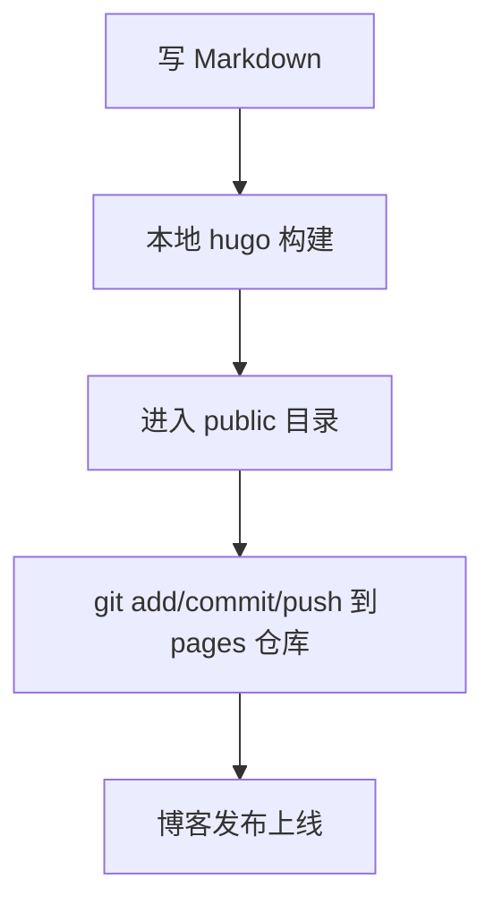
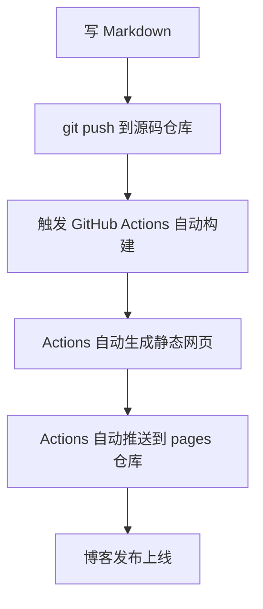

+++
date = '2025-11-09T17:45:35+08:00'
draft = false
title = '使用GitHub Action 自动化部署blog'
+++


在日常写博客时，如果每次都需要本地执行 `hugo` 构建命令、进入 public 目录、再手动 `git push`，效率低且易出错。现代开发讲究 CI/CD（持续集成/持续部署），其实我们能完全自动化博客发布，让你专注写 Markdown，其余交给 GitHub Actions 实现自动部署。

## 前后流程对比

在进入详细流程前，先来看博客部署的前后对比流程图：

### 🕹️ 传统手动部署流程



### 🚀 自动化部署（CI/CD）流程



可以看到，自动化部署后，你只需要写好 Markdown 并 `git push`，其它琐事全部交给自动流水线，极大提高效率和安全性。

## 一、整体流程说明

自动化部署 Hugo 博客的基本流程如下：

1. **博客源码仓库**：创建一个私有仓库（如 `my-blog-source`），存放你的 Markdown 博文和配置文件（`content/`、`config.toml` 等）。
2. **部署仓库**：使用另一个公开仓库（如 `neo-dai/neo-dai.github.io`），用于托管 `public` 生成的静态网页，这就是你 GitHub Pages 访问的网址。
3. **GitHub Actions**：在源码仓库（`my-blog-source`）配置自动化 CI/CD 工作流（`.github/workflows/deploy.yml`）。今后你只需要将 Markdown 推送到此仓库，其它步骤全自动完成。

## 二、详细步骤

### 1. 源码与部署仓库区分

- `my-blog-source`（私有）：只存 Hugo 博客源码、markdown、主题和 config。
- `neo-dai.github.io`（公开）：只存静态页面，供公开访问。

> 为什么这样设计？  
> Hugo 主题、草稿、源文件等可以私密保存，博客源码独立于真正发布目录，也更易维护。

### 2. 生成 SSH 部署密钥

自动部署需要 GitHub Actions 写入你的部署仓库。推荐在本地生成 SSH 部署密钥，并配置到仓库（详见下方说明）。

1. 本地或用脚本生成一对密钥：
   ```bash
   ssh-keygen -t rsa -b 4096 -C "hugo-deploy@github-actions" -f ~/.ssh/hugo_deploy_key
   ```
2. **将公钥（.pub）**添加到 `neo-dai.github.io` 仓库的 Deploy Keys，并勾选 write。
3. **将私钥**内容配置到 `my-blog-source` 的 Secrets，名称如 `ACTIONS_DEPLOY_KEY`。

> （密钥配置更详细操作可见文末附录。）

### 3. 编写 GitHub Actions workflow

在 `my-blog-source/.github/workflows/` 下新建 `deploy.yml`：

```yml
name: Deploy Hugo Site to GitHub Pages

on:
  push:
    branches:
      - main  # 只在向 main 分支 push 时触发

jobs:
  build-and-deploy:
    runs-on: ubuntu-latest
    
    steps:
      # Step 1. 拉取源码
      - name: Checkout
        uses: actions/checkout@v4
        with:
          submodules: true
          fetch-depth: 0

      # Step 2. 安装 Hugo
      - name: Setup Hugo
        uses: peaceiris/actions-hugo@v3
        with:
          hugo-version: 'latest'
          extended: true

      # Step 3. 构建博客
      - name: Build
        run: hugo --minify

      # Step 4. 发布到 GitHub Pages
      - name: Deploy
        uses: peaceiris/actions-gh-pages@v4
        with:
          deploy_key: ${{ secrets.ACTIONS_DEPLOY_KEY }}
          external_repository: neo-dai/neo-dai.github.io
          publish_branch: main
          publish_dir: ./public
          # cname: www.your-domain.com # 如有自定义域名可启用
          commit_message: "Automated deployment: ${{ github.event.head_commit.message }}"
```

### 4. 配置关键点解读

- **deploy_key**：用前面步骤生成并添加到 Secrets 的私钥名。
- **external_repository**：格式为 `用户名/你的github.io仓库名`。
- **publish_branch**：通常是 `main`。
- **publish_dir**：Hugo 构建输出目录（通常就是 `public`）。
- 有自定义域名，解除 `cname` 注释并填写即可。

### 5. 推送触发，自动发布

以后你的流程就极为清晰：

1. **新文章** ➔ 直接写 Markdown，`git add . && git commit -m "write blog" && git push`
2. **自动触发** ➔ GitHub Action 检测到 push，自动构建并将静态网页发布至部署仓库
3. **几分钟后访问** ➔ 你的博客网址即可看到新内容

## 三、常见问题

- SSH 密钥泄露怎么办？立即更换并撤销，有风险勿行公开仓库 secrets。
- 如何排查 Action 失败？Actions 页面点进 build-and-deploy，查 logs。
- 如何绑定自定义域名？在 deploy 步骤配置 `cname`，并在部署仓库根目录加 `CNAME` 文件即可。

## 四、参考资源

- [Hugo 官方文档](https://gohugo.io/)
- [peaceiris/actions-hugo](https://github.com/peaceiris/actions-hugo)
- [peaceiris/actions-gh-pages](https://github.com/peaceiris/actions-gh-pages)
- [GitHub Actions 官方文档](https://docs.github.com/en/actions)

---

> **附录：更详细的密钥和 Actions 配置可参见[本仓库 DEPLOY.md 文档](../DEPLOY.md)。实操遇到问题欢迎评论或 Issues 交流。**
